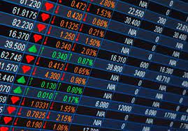

# Introduction

Every stock market investor knows the pain of stock fluctuation, since predicting the stock market's direction is one of the hardest thing to do. There are many factors involved, from overall economy performance or company's fundamentals to news catalysts or market makers' manipulation. As an investor, I am interested to figure out if Machine Learning algorithms have the potential to unearth patterns in the stock market that human cannot detect, which can be used to improve the accuracy of stock prediction. In this project, I perform stock price prediction by applying Machine Learning algorithms on historical data of Apple and Dow Jones Industrial Average.

## Apple stock price prediction

### Decision Tree

### Random Forest

## Dow Jones index price prediction

### Decision Tree

### Random Forest

