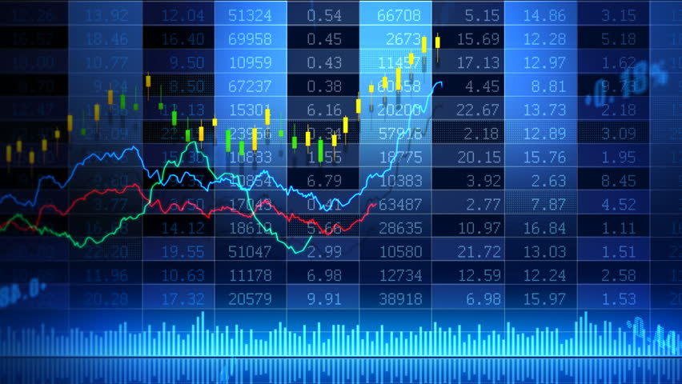

# Introduction

Every stock market investor knows the pain of stock fluctuation, since predicting the stock market's direction is one of the hardest thing to do. There are many factors involved, from overall economy performance or company's fundamentals to news catalysts or market makers' manipulation. As an investor, I am interested to figure out if Machine Learning algorithms have the potential to unearth patterns in the stock market that human cannot detect, which can be used to improve the accuracy of stock prediction. In this project, I perform stock price prediction by applying Machine Learning algorithms on historical data of Apple and Dow Jones Industrial Average.

#### Data Source: Yahoo! Finance

## Apple stock price prediction

### k-nearest Neighbors

MAE for k-nearest Neighbor Model: 42.49498786181139

k-nearest neighbors predict the fluctuation well. But it detects a falling partern and then predict the valiadation data with huge Mean Absolute Error, so it does not work really well with this dataset.

### Prophet

MAE for Prophet Neighbor Model: 13.646571885895778

### ARIMA

MAE for ARIMA Model: 11.128750949391991

### Decision Tree

MEA for best max_leaf_nodes: 11.131870399548708

### Random Forest

MAE for Random Forest Model: 11.484951699346409

Decision Tree and Random Forest can make solid predictions. However, they cannot predict the stock prices in validating dataset that are higher than the maximun stock price in training dataset

## Dow Jones index price prediction

### k-nearest Neighbors

MAE for k-nearest Neighbor Model: 1284.4782757124183

k-nearest neighbors fits Dow Jones dataset much more than Apple dataset.

### Prophet

MAE for Prophet Neighbor Model: 4327.612685790688

### ARIMA

MAE for ARIMA Model: 3491.5669587435577

### Decision Tree

MEA for best max_leaf_nodes: 491.78889321776705

### Random Forest

MAE for Random Forest Model: 189.0973996753243

So, with stock (or index) prices where validation prices are not higher than the maximum price in training dataset, Decision Tree and Random Forest prediction is really powerful!

However, as mentioned in the beginning, keep in mind that stock (or index) prices are affected by news about the market or the company and by the company's fundamentals, so there are still a lot of possible factors that are not accounted for in this model.
